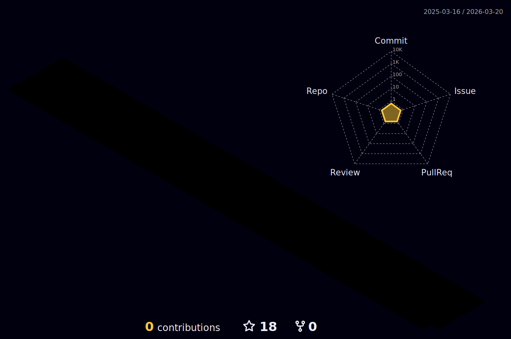

 

 
 

<table>
<tr>
<td>

  
- Desenvolvedor Front-End & Mobile Flutter.

- Técnico em Desenvolvimento de Sistemas - Formado.

- Senai Jorge Mahfuz.

</td>
<td>

</td>
</tr>
</table>

 

<h2>

    

</h2>

 

### Main skills

 

- HTML - CSS - JavaScript - Bootstrap, PHP, MySQL, Dart, Flutter - Git & GitHub, UI/UX, Acessibilidade VLibras.

- WebStorm, PhpStorm, IntelliJ, VSCode, Figma, AdobeXD, Trello, Scrum.

 
 

### Estatísticas

<table align="center">
<tr>
 
<td><a href="https://github.com/davydcristiano">
</td>
<td><a href="https://github.com/davydcristiano">
</td>
</tr>
</table>

 
<b>Visitors Count</b>
  

 
 

