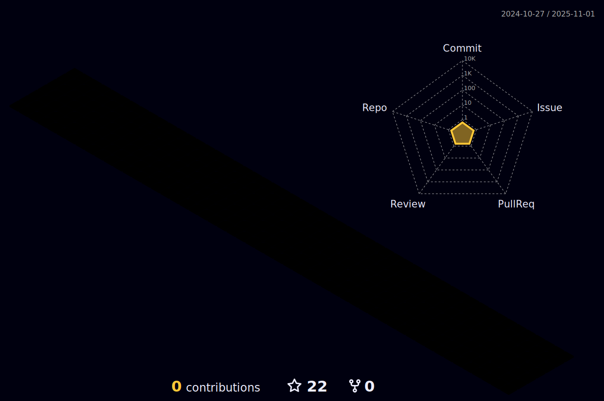

 

 
 

 

- Desenvolvedor Front-End Jr.

- Estudante Técnico em Desenvolvimento de Sistemas.

- Senai.

 

<h2>
 Olá, Sejam bem-vindos! 
</h2>

### Main skills
- HTML - CSS - JavaScript - Bootstrap, Java, PHP, MySQL, Dart, Flutter - Git & GitHub, UI/UX, Acessibilidade VLibras.
- WebStorm, PhpStorm, VSCode, Figma, AdobeXD, Trello, Scrum.

 
 

### Estatísticas

<table align="center">
<tr>
 
<td><a href="https://github.com/davydcristiano">
</td>
<td><a href="https://github.com/davydcristiano">
</td>
</tr>
</table>

 
<b>Visitors Count</b>
  

 
 

